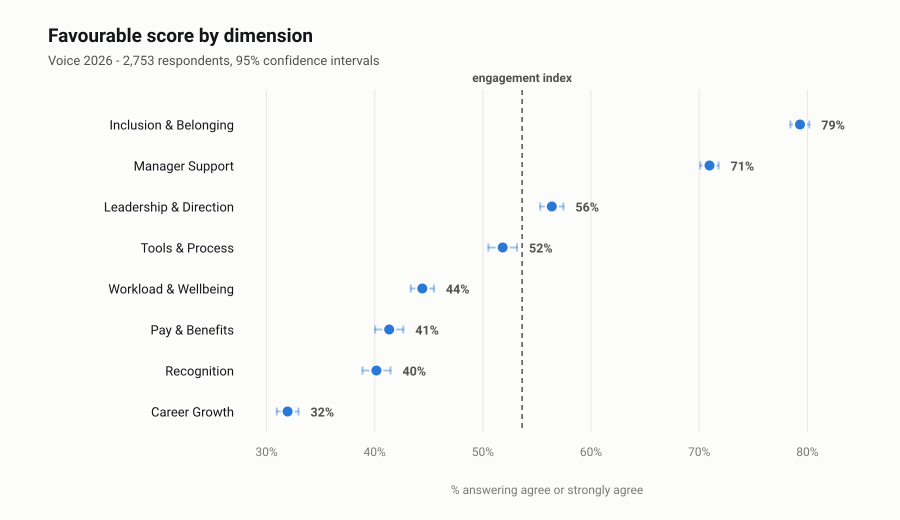
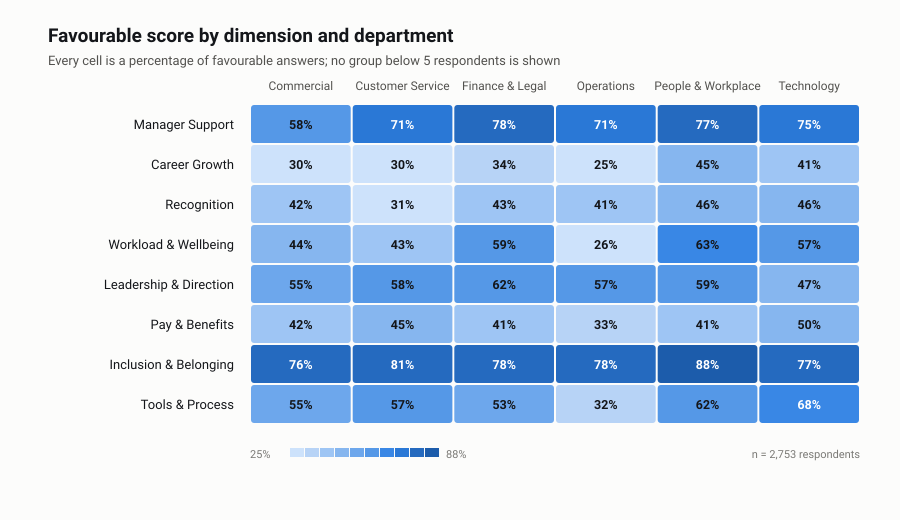
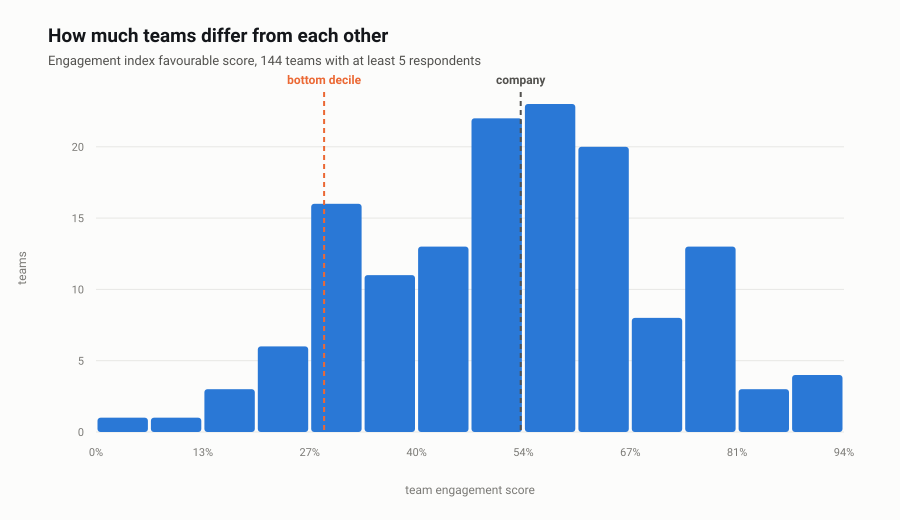
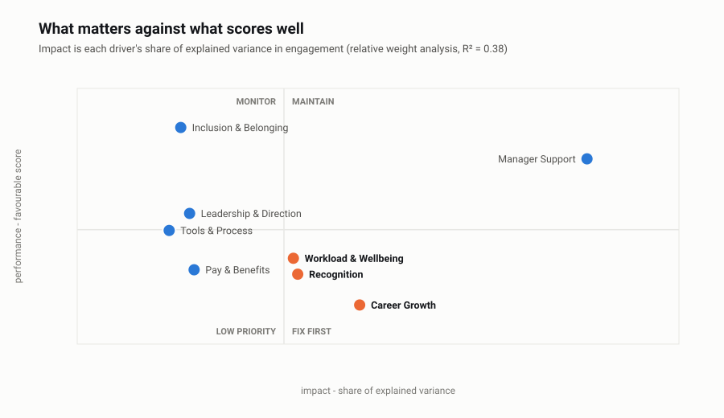
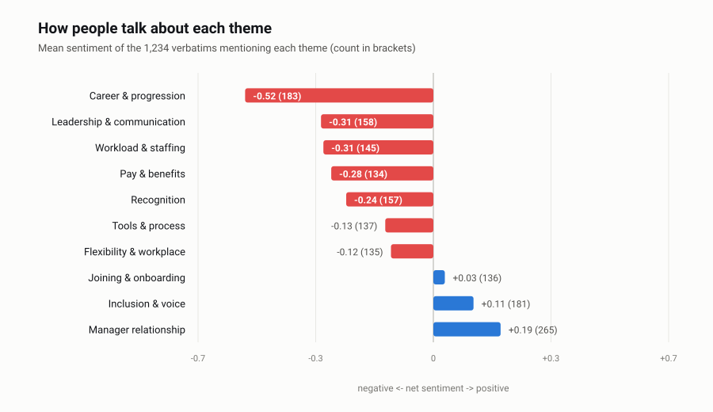
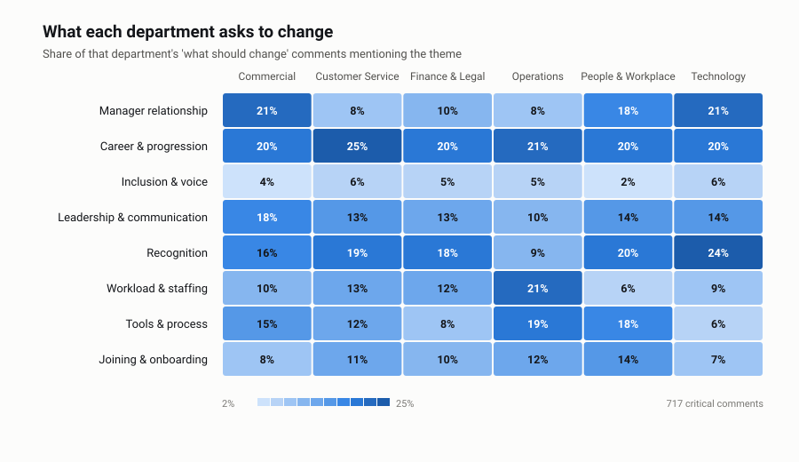

# Voice 2026 - survey read-out

**Fieldwork:** 4-22 May 2026
**Population:** a synthetic European services group - 3,800 employees, 149 teams,
four countries
**Generated by:** `python3 src/run_all.py` - every number, chart and quotation below is
reproduced from the code in this repository

> The survey, the answers and the comments are synthetic, generated with a fixed seed by
> `src/generate_survey.py`. No real employee ever wrote any of this. What is meant to be
> judged is the method: how participation is checked before results are quoted, how drivers
> are separated from noise, and how free text is scored before it is believed.

---

## 1. Participation and scores

**Voice 2026** ran 4-22 May 2026. **2,753 of 3,800** employees responded - **72.4%** (95% CI 71.0%-73.8%).

### Who answered, and who did not

Response rate runs from **61% in Operations** to **83% in Finance & Legal**, and shift workers answered at **57%** against **79%** for everyone else. That gap is not an administrative detail: it decides whose experience the results describe.

| Department | Invited | Responded | Rate | Share of respondents vs share of workforce |
| :--- | ---: | ---: | ---: | ---: |
| Operations | 1,178 | 722 | 61% | -4.8 pp |
| Customer Service | 912 | 661 | 72% | +0.0 pp |
| Commercial | 532 | 419 | 79% | +1.2 pp |
| People & Workplace | 342 | 270 | 79% | +0.8 pp |
| Technology | 494 | 397 | 80% | +1.4 pp |
| Finance & Legal | 342 | 284 | 83% | +1.3 pp |

**Operations** is the most under-represented group at **-4.8 pp**. Non-response is rarely random - the people with least time and least trust are the least likely to answer - so the true company scores are more likely to sit below these numbers than above them. Every result in this report should be read with that direction of error in mind.

### The headline

| Measure | Result | Read |
| :--- | ---: | :--- |
| Engagement index | **54% favourable** | 95% CI 52.5%-54.7%, 8,259 answers |
| eNPS | **-12** | 22% promoters, 43% passives, 34% detractors |
| Response rate | **72.4%** | 2,753 of 3,800 invited |
| Teams reported | **144** | 5 suppressed for being below 5 respondents |

A negative eNPS means more people would actively warn a friend off working here than would recommend it. With 34% detractors, this is not a communications problem to be reframed; it is the thing the rest of the report has to explain.

### Dimension scores

| Dimension | Favourable | 95% CI | Mean (1-5) | Answers |
| :--- | ---: | ---: | ---: | ---: |
| Inclusion & Belonging | **79%** | 78%-80% | 4.17 | 8,259 |
| Manager Support | **71%** | 70%-72% | 4.00 | 11,012 |
| Leadership & Direction | **56%** | 55%-57% | 3.59 | 8,259 |
| Tools & Process | **52%** | 51%-53% | 3.48 | 5,506 |
| Workload & Wellbeing | **44%** | 43%-45% | 3.28 | 8,259 |
| Pay & Benefits | **41%** | 40%-43% | 3.20 | 5,506 |
| Recognition | **40%** | 39%-41% | 3.17 | 5,506 |
| Career Growth | **32%** | 31%-33% | 2.94 | 8,259 |

The spread is wide: **Inclusion & Belonging** at 79% and **Career Growth** at 32%. The intervals are narrow enough at this sample size that the ranking is real rather than sampling noise - which is not true of the team-level numbers further down.

### Where it differs by department

Cells are tested against the rest of the company, not just compared. The gaps that survive a two-proportion test at p < 0.01:

| Department | Dimension | Favourable | vs rest of company |
| :--- | :--- | ---: | ---: |
| Operations | Tools & Process | 32% | -20.0 pp |
| Operations | Workload & Wellbeing | 26% | -18.0 pp |
| Commercial | Manager Support | 58% | -12.7 pp |
| Customer Service | Recognition | 31% | -9.6 pp |
| Technology | Leadership & Direction | 47% | -9.4 pp |
| Operations | Pay & Benefits | 33% | -8.1 pp |
| Operations | Career Growth | 25% | -7.3 pp |
| Commercial | Inclusion & Belonging | 76% | -2.9 pp |

### The company average hides the teams

Across the 86 teams with at least 15 respondents - small teams swing too much to compare - the engagement index runs from **18%** to **94%**. The bottom decile sits at **29%** and the top at **78%** - a **49 percentage point** spread inside one company. An organisation-wide programme aimed at the average would be aimed at almost nobody.

**5 teams are not reported at all**, because they have fewer than 5 respondents. That rule is not bureaucracy: it is the promise that made people answer honestly, and the first time a manager works out who said what, the next survey is worthless.

**34 teams sit significantly below the company score** - their whole 95% interval is below it, so this is not small-team noise. The ten lowest:

| Team | Department | Respondents | Engagement index | 95% CI |
| :--- | :--- | ---: | ---: | ---: |
| T015 | Operations | 5 | 0% | 0%-20% |
| T060 | Customer Service | 13 | 10% | 4%-24% |
| T012 | Operations | 10 | 17% | 7%-34% |
| T147 | People & Workplace | 30 | 18% | 11%-27% |
| T069 | Customer Service | 7 | 19% | 8%-40% |
| T091 | Commercial | 35 | 21% | 14%-30% |
| T047 | Operations | 14 | 24% | 13%-39% |
| T117 | Technology | 25 | 24% | 16%-35% |
| T042 | Operations | 17 | 25% | 16%-39% |
| T023 | Operations | 28 | 26% | 18%-36% |

This is the list a People Partner works through, in this order - and the interval column is why it is a conversation list and not a ranking: the difference between first and fourth on it is not measurable.

## 2. What actually drives engagement

Eight dimensions explain **38%** of the variation in the engagement index across 2,753 respondents. Below, *impact* is each dimension's share of that explained variance, and *performance* is its favourable score.

| Dimension | Impact | 90% bootstrap range | Rank range | Favourable | Correlation | Std. beta |
| :--- | ---: | ---: | ---: | ---: | ---: | ---: |
| Manager Support | **40%** | 35%-43% | 1 | 71% | 0.48 | +0.34 |
| Career Growth | **19%** | 15%-23% | 2-4 | 32% | 0.39 | +0.19 |
| Recognition | **14%** | 11%-17% | 2-4 | 40% | 0.33 | +0.14 |
| Workload & Wellbeing | **13%** | 11%-16% | 2-4 | 44% | 0.32 | +0.17 |
| Pay & Benefits | **4%** | 3%-6% | 5-8 | 41% | 0.22 | +0.07 |
| Leadership & Direction | **4%** | 3%-6% | 5-8 | 56% | 0.20 | +0.07 |
| Inclusion & Belonging | **3%** | 2%-5% | 5-8 | 79% | 0.20 | +0.04 |
| Tools & Process | **2%** | 1%-3% | 5-8 | 52% | 0.19 | +0.01 |

**Manager Support** carries **40%** of the explained variance, more than the bottom four dimensions combined (14%). **Tools & Process** carries **2%** - it is not unimportant to people, it is simply not what separates an engaged employee from a disengaged one here.

### How much of this ranking can we trust

The weights were recomputed on **120 bootstrap resamples** of the respondent pool. The rank range column shows where each dimension landed across those runs.

**Manager Support** finished first in every single resample, so the headline of this analysis is not a sampling artefact. **Career Growth** and **Recognition** never fell below 4th, so they are the second tier - but they trade places with each other, and arguing about which of them is second is arguing about noise. **Workload & Wellbeing**, **Pay & Benefits**, **Leadership & Direction** and 2 others move by two or more places between resamples. Their order relative to each other is not a finding, and a read-out that calls one of them 'the fifth priority' is reading noise.

### The priority quadrant

High impact and a low score is the only quadrant that earns investment: **Career Growth** (19% impact, 32% favourable), **Recognition** (14% impact, 40% favourable), **Workload & Wellbeing** (13% impact, 44% favourable).

Compare that with **Pay & Benefits** at 41% favourable but only 4% impact. Pay is the loudest complaint in the free text and one of the lowest scores in the survey, and it still is not what moves engagement in this company. A pay review would buy goodwill; it would not buy engagement. That is an uncomfortable finding to present, which is exactly why it needs the bootstrap behind it.

### What the gap is worth

Rather than extrapolate from the model, compare like with like: among teams with at least 10 respondents, those in the **top quartile on Manager Support** score **72%** on the engagement index, against **36%** for the bottom quartile - a **37 percentage point** difference. That is an observed contrast between teams, not a promise about what a programme would deliver; teams differ in more ways than one dimension. It does say that the difference between a good and a poor experience of manager support is visible at the size that matters.

## 3. What people wrote

**1,234 verbatims** from **879 of 2,753** respondents (32%). Detractors write critical comments at **1.9 times** the rate of promoters (0.34 per detractor against 0.18 per promoter), so the free text over-represents the unhappy by construction. That is useful - it is where the problems are described - as long as volume is never mistaken for prevalence.

### First: does the text pipeline actually work?

Theme tagging uses a keyword lexicon that lives in [`src/textlib.py`](../src/textlib.py) and can be read, argued with and changed. It tagged at least one theme on **97%** of comments. Scored against a labelled set:

| Theme | Precision | Recall | F1 | False positives | Misses |
| :--- | ---: | ---: | ---: | ---: | ---: |
| Career & progression | 1.00 | 1.00 | **1.00** | 0 | 0 |
| Flexibility & workplace | 1.00 | 1.00 | **1.00** | 0 | 0 |
| Inclusion & voice | 1.00 | 1.00 | **1.00** | 0 | 0 |
| Joining & onboarding | 1.00 | 1.00 | **1.00** | 0 | 0 |
| Recognition | 1.00 | 1.00 | **1.00** | 0 | 0 |
| Leadership & communication | 0.84 | 1.00 | **0.91** | 25 | 0 |
| Workload & staffing | 0.83 | 1.00 | **0.91** | 25 | 0 |
| Pay & benefits | 1.00 | 0.81 | **0.90** | 0 | 31 |
| Tools & process | 0.77 | 1.00 | **0.87** | 32 | 0 |
| Manager relationship | 0.66 | 0.89 | **0.76** | 89 | 21 |

Macro F1 is **0.93**. The weakest theme is **Manager relationship** (F1 0.76, 89 false positives): comments about something else that mention a manager in passing get pulled in. That is the honest cost of a keyword approach, and the reason the themes are reported as a ranked shape of the conversation rather than as exact counts.

*Read that score with its ceiling in mind: these verbatims are assembled from a template bank, so a keyword lexicon has an easier job here than it would on real free text, where people paraphrase, misspell and use irony. What the evaluation establishes is that the pipeline is measured at all and that its failure mode is known - not that 0.9 would survive contact with a real corpus.*

Sentiment is a word list with negation handling, not a language model. Against the labelled tone it gets **67%** of negative comments right, **71%** of positive comments right, and a respondent's average comment sentiment correlates **r = 0.28** with their own eNPS score. That is good enough to rank themes by tone and nowhere near good enough to judge an individual comment - which is why nothing downstream does.

### Volume and tone by theme

| Theme | Comments | Share of verbatims | Mean sentiment |
| :--- | ---: | ---: | ---: |
| Manager relationship | 265 | 21% | +0.19 |
| Career & progression | 183 | 15% | -0.52 |
| Inclusion & voice | 181 | 15% | +0.11 |
| Leadership & communication | 158 | 13% | -0.31 |
| Recognition | 157 | 13% | -0.24 |
| Workload & staffing | 145 | 12% | -0.31 |
| Tools & process | 137 | 11% | -0.13 |
| Joining & onboarding | 136 | 11% | +0.03 |
| Flexibility & workplace | 135 | 11% | -0.12 |
| Pay & benefits | 134 | 11% | -0.28 |

### Where the complaints concentrate

| Theme | Share of detractor comments | Share of promoter comments | Ratio |
| :--- | ---: | ---: | ---: |
| Manager relationship | 16% | 9% | **1.7x** |
| Recognition | 18% | 16% | **1.2x** |
| Joining & onboarding | 11% | 9% | **1.1x** |
| Workload & staffing | 12% | 11% | **1.1x** |
| Inclusion & voice | 4% | 5% | **0.9x** |
| Career & progression | 21% | 25% | **0.8x** |

**Manager relationship** appears in 16% of what detractors ask to change against 9% for promoters - **1.7 times** as often. Themes with a high ratio are the ones that separate the two groups; themes that appear equally in both are the everyday friction everyone lives with.

### Do the words agree with the numbers?

Across every department-and-theme combination, the share of comments raising a theme correlates **r = -0.67** with the favourable score on the matching survey dimension. They are two instruments measuring the same thing, and they agree - which is the reassurance to give a leadership team that wants to dismiss the free text as 'just the vocal minority'.

### The language each department uses

| Department | Distinctive terms in their 'what should change' comments |
| :--- | :--- |
| Commercial | `access`, `tool`, `takes week`, `avoids`, `problems` |
| Customer Service | `role`, `route`, `training`, `budget`, `exists` |
| Finance & Legal | `role`, `hire`, `externally`, `inside`, `grow` |
| Operations | `firefighting`, `capacity`, `planned`, `access`, `tool` |
| People & Workplace | `training`, `budget`, `exists`, `paper`, `postponed` |
| Technology | `role`, `kept`, `inflation`, `running`, `two year` |

These are terms weighted by how much *more* one group uses them than the others, so they are the language specific to that group rather than the words everybody uses.

### In their own words

Verbatims are published only from groups of at least 5 respondents, after an automated pass that removes names, emails and phone numbers.

**Manager relationship**
> "The main issue is that leadership talks about transparency and then reorganises without warning. Otherwise this is a good place to work. My manager avoids difficult conversations, so problems in the team just continue."  
> — Commercial, 10 years + tenure
>
> "The main issue is that the approval process takes longer than the work itself. Otherwise this is a good place to work. Recognition stops at my manager and never travels further up."  
> — Operations, 10 years + tenure
>

**Career & progression**
> "The main issue is that good work is expected and never mentioned; mistakes are mentioned immediately. This needs fixing this year. Training budget exists on paper but every request gets postponed."  
> — Operations, 3-5 years tenure
>
> "Honestly, recognition stops at my manager and never travels further up. It should not be this hard. Promotions here go to people who are visible to leadership, not to people who deliver."  
> — Customer Service, 6-10 years tenure
>

**Inclusion & voice**
> "The office rules changed twice this year with no explanation. The rest of my experience here is positive. Everything important is decided in English at a speed that excludes half the room."  
> — Operations, 3-5 years tenure
>
> "The office rules changed twice this year with no explanation. Otherwise this is a good place to work. The same voices dominate every meeting and the rest of us stop trying."  
> — Finance & Legal, 6-10 years tenure
>

**Leadership & communication**
> "The main issue is that leadership talks about transparency and then reorganises without warning. Otherwise this is a good place to work. My manager avoids difficult conversations, so problems in the team just continue."  
> — Commercial, 10 years + tenure
>
> "Honestly, recognition stops at my manager and never travels further up. It should not be this hard. Promotions here go to people who are visible to leadership, not to people who deliver."  
> — Customer Service, 6-10 years tenure
>

---

## Method, assumptions and limits

**Favourable scoring.** A dimension's score is the share of answers in the top two points
of the five-point scale, pooled across the items in that dimension. Every rate is reported
with a **Wilson confidence interval**, which behaves properly near 0% and 100% where the
textbook interval produces impossible bounds. Group comparisons use a two-proportion
z-test rather than an eyeballed gap.

**Confidentiality.** No score is published for any group below **5 respondents** -
in the report, in the team lists, and in the dashboard, where filtering below the threshold
masks the tiles as well as the charts. This is the promise that makes people answer
honestly; it is worth more than any single cut of the data.

**Key driver analysis.** Engagement is modelled from the eight dimension scores using
Johnson's relative weight analysis. Ordinary regression coefficients are unstable when
predictors are as correlated as survey dimensions are: they hand shared variance to
whichever driver wins a near-tie. Relative weights split the explained variance sensibly,
and a **bootstrap over resampled respondents** shows which parts of the resulting ranking
survive resampling and which do not. Standardised betas and simple correlations are
reported alongside, so the reader can see all three agree on the top of the list.

**Free text.** Themes are assigned by a keyword lexicon and sentiment by a word list with
negation handling - both in `src/textlib.py`, both readable and arguable. Neither is a
language model, and the report states the measured precision, recall and error rates
before drawing on the results. Comments are analysed only in aggregate; nothing is ever
inferred about an individual, and verbatims are published only from groups above the
threshold, after an automated pass that strips names, emails and phone numbers.

**Limits.** One survey, one moment, one organisation. Cross-sectional data cannot establish
that improving a driver *causes* engagement to rise - the driver analysis ranks
associations, and the report says so wherever a number could be read as a promise.
Non-response is not random: the groups least likely to answer are the ones under most
pressure, so company-level scores are more likely to be flattering than harsh.
